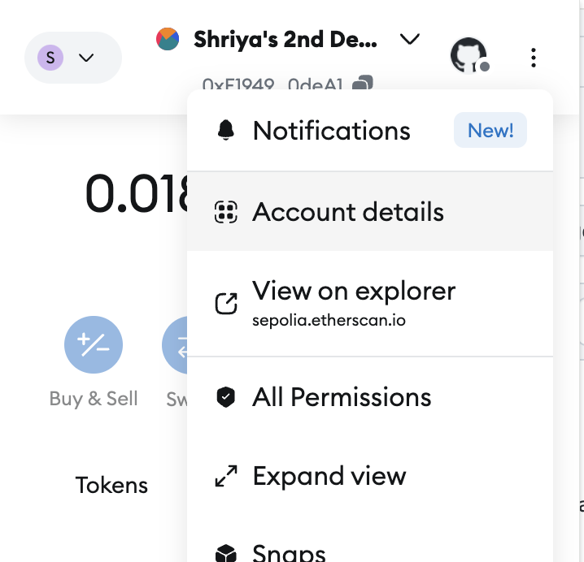
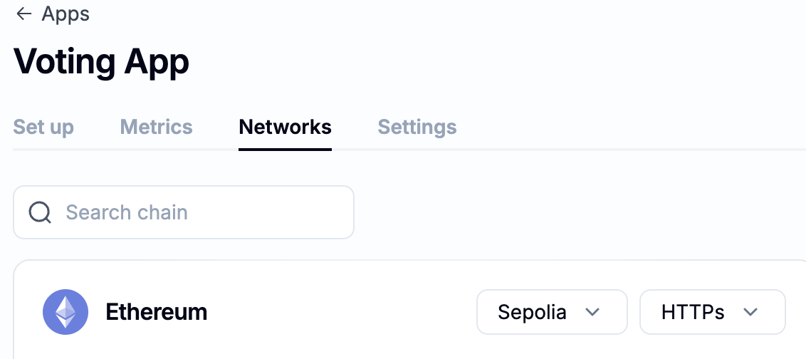

# Welcome to building your first Web3 dApp @ HackSC-2024! 💻 ⭐️ 🥳

To navigate to running instructions, click  [here](#follow-the-instructions-below-to-run-your-app)


To navigate to creating a MetaMask/Crypto Wallet click [here](#how-to-get-sepolia-test-eth) 

## Environment Setup

- Fork the repo at https://github.com/BlockchainUSC/HackSC-2024/ 
- Navigate to the folder where you want to store your repo in your terminal
- Clone the repo by typing `git clone <URL>`, where `<URL>` is the link that appears after hitting the green **Code** button in the top right of your repo.

## Initial Setup 
Navigate to frontend folder in terminal

Run `npm install`

Run `npm install ethers@5`

Run `npm run start` to view current frontend of our page

## Writing our Smart Contract
 
 Navigate to the blockchain/contracts folder in terminal

 Open the **Voting.sol** file

 Add the following lines of the code at the top of the file to specify which version of Solidity we are using:

```solidity
// SPDX-License-Identifier: MIT
pragma solidity ^0.8.0;
```


## Contract Initialization

Set up our initial contract by giving it a name

Add `contract Voting {` to the file (this contract is called Voting)

Add our **state variables** to the file: 

```solidity 
    bool public votingStarted = false;
    string public candidate1;
    string public candidate2;

    uint public votesCandidate1= 0;
    uint public votesCandidate2 = 0;
```

State variables are valuables whose values are permanently stored in a contract storage rather than a specific function.


Add our **events** to the file:

```solidity
event VotingStarted(string candidate1, string candidate2);

event Voted(string candidate);

event VotingEnded();
```

**Events** are a mechanism that allow smart contracts to emit logs when certain actions occur. Thus, when a change in our smart contract occurs, like voting has started, a vote occurred, or voting has ended, we will emit an event to the frontend or any other entity that may be listening for such events.

Our contract has three events: VotingStarted – to indicate the voting has been initiated, Voted – to indicate that a vote has been cast, and VotingEnded – to indicate that the current voting session is over. 


Add an empty constructor to the file since our smart contract doesn't need any initial arguments before being deployed: 

```solidity
constructor() {
}
```

## Start Voting Function
Add the following start voting function to the file:

```solidity

function start_voting(string memory c1, string memory c2) public {
        require(!votingStarted, "Voting has already started");
        votingStarted = true;
        candidate1 = c1;
        candidate2 = c2;
        votesCandidate1 = 0;
        votesCandidate2 = 0;

        emit VotingStarted(c1, c2);
    }

```

The **require** function ensures that user's input is valid and that voting hasn't already started.

Then we set the votingStarted state variable to true.

Then, we update our candidate1 and candidate2 state variable to be the user's input.

We also initialize our state variables for votes for each candidate to be 0.

Lastly, we emit the VotingStarted event passing in the two candidate names as parameters.


## Vote function

Add the following vote function to the file:

```solidity
function vote(string memory candidate) public {
        require(keccak256(abi.encodePacked(candidate)) == keccak256(abi.encodePacked(candidate1)) || keccak256(abi.encodePacked(candidate)) == keccak256(abi.encodePacked(candidate2)), "Invalid candidate");
        require(votingStarted, "Voting has not started");
        if (keccak256(abi.encodePacked(candidate)) == keccak256(abi.encodePacked(candidate1))) {
            votesCandidate1++;
        } else {
            votesCandidate2++;
        }
        emit Voted(candidate);
    }
```

The first **require** statement is checking if the keccak-256 hash of the value of the candidate matches one of the keccak-256 hash of the two candidate state variables.

The second **require** statement checks if the votingStarted state variable is true.

Then, we increment the related votes for a given candidate depending on whether the user passed in the value for candidate1 or candidate2. 

Lastly, we emit a voted event that takes in the candidate we voted for as an argument.


## End Voting function

Add the following end voting function into the file:

```solidity
function endVoting() public {
        require(votingStarted, "Voting has not started");
        votingStarted = false;
        emit VotingEnded();
    }
```

The **require** statement checks if voting has started, otherwise it cannot end voting.

It then sets the votingStarted state variable to false and emits the VotingEnded event.

## Declare Winner Function

Add the following declare winner function to the file:

```solidity
function declareWinner() public view returns (string memory) {
        if (votesCandidate1 > votesCandidate2) {
            return candidate1;
        } else if (votesCandidate1 == votesCandidate2) {
            return "Tie!";
        }
        else {
            return candidate2;
        }
        }

```

We don't need to check if voting started here because our frontend (App.tsx) always calls endVoting before we call declareWinner.

Then, we return the candidate with more votes in the votesCandidate[num] state variable. If the votes are equal, we return a tie.


## Finish Contract

Lastly, add a final `}` to the end of the file to finish the contract!


## Adding your environment variables

Create a file called `.env`  in your blockchain folder (don't place it in any subfolders)

>Add your MetaMask private key to the top of the .env file using the following format:
`PRIVATE_KEY="<YOUR-PRIVATE-KEY>"`

You can access your MetaMask private key by:
- Clicking on your extension
- Hitting the top 3 vertical ellipses in the top right
- Clicking on Account Details
- View the image below for a visual aid



Then, navigate to your [Alchemy Dashboard](https://dashboard.alchemy.com/)

- Create a New App
- Give it a name (i.e. Voting App)
- Select any Use Case
- Choose _*Ethereum*_ as your chain
- Click **Create App**
- Navigate to the networks tab
- Click on the dropdown next to Ethereum and choose Sepolia. An image is added below for visual aid

- Copy the link that begins with https://eth-sepolia.g.alchemy.com/v2/...

>Add your Alchemy API URL to the .env file using the following format:
`API_URL="<YOUR-ALCHEMY-URL>"`


## Updating hardhat.config.ts

Navigate to blockchain/hardhat.config.ts in your file editor and update it to the following code:
```typescript
import { HardhatUserConfig } from "hardhat/config";
import "@nomicfoundation/hardhat-toolbox";
import { config as dotenvConfig } from "dotenv";

dotenvConfig();

const Private_Key = process.env.PRIVATE_KEY;
const API_URL= process.env.API_URL;

const config: HardhatUserConfig = {
  solidity: "0.8.18",
  networks: {
    sepolia: {
      url: `${API_URL}`,
      accounts: [`0x${Private_Key}`],
    },
  },
};

export default config;
```

## Creating a Deploy Script
- Navigate to blockchain/scripts/deploy.ts in your file editor
- Update the deploy script to look like this:

```typescript

import { ethers } from "hardhat";

async function main () {
  // We get the contract to deploy
 const vote = await ethers.deployContract("Voting");

 console.log('Deploying Contract...');
 //Program waits until counter is deployed before moving onto next line of code
 await vote.waitForDeployment();

 //prints the countract's target, its address on the blockchain
console.log(`Voting deployed to: ${vote.target}`);
}

main()
  .then(() => process.exit(0))
  .catch(error => {
    console.error(error);
    process.exit(1);
  });

```

## Deply your Smart Contract

Navigate to the blockchain folder in your terminal

- Run `npx hardhat compile` to compile the smart contract
- Run `npx hardhat run scripts/deploy.ts --network sepolia` to run the script to deploy the smart contract

You should see an output like:

>Counter deployed to: 0x75F7921BB70b3C6c0e88a0808C335F9d369fEbC3


## Congrats on your first Web3 dApp! 🥳

### Follow the instructions below to run your app:
Navigate to frontend in terminal and run 
- `npm install` 
- `npm run dev`
- Navigate to http://localhost:3000/


# Supplemental Information

### Setting up Your MetaMask Wallet 💰
Prerequisites:
- Google Chrome Extension
1. Go to https://metamask.io/
2. Select Download and Install for Chrome 
3. Select Create New Wallet
4. Create your password
5. Secure your wallet and write down your secret recovery phrase 
6. Now, your wallet is all set up for use in our projects!

### How to get Sepolia Test ETH
1. Navigate to https://cloud.google.com/application/web3/faucet or https://www.alchemy.com/faucets/ethereum-sepolia and place your account's public address in the box.
2. Hit Enter to secure your Sepolia Test ETH
3. These faucets are designed to give developer Test ETH so you can explore Web3 development without needing to spend money.
4. > 📌 **Note:** You may need 0.001 ETH in your account on Ethereum Mainnet to receive test ETH.


